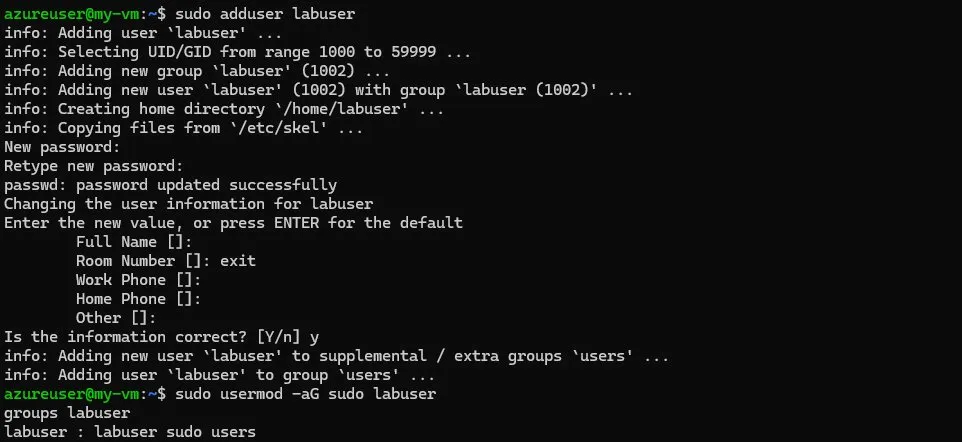
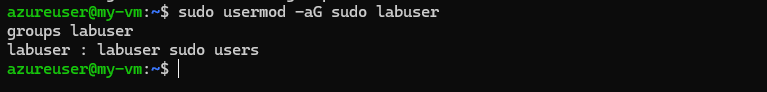
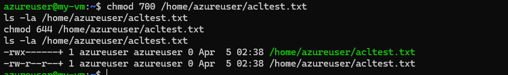
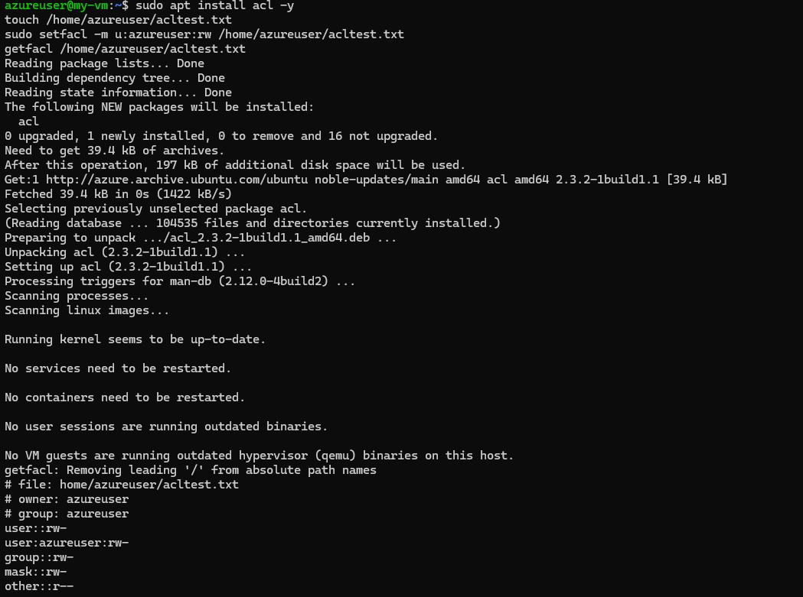
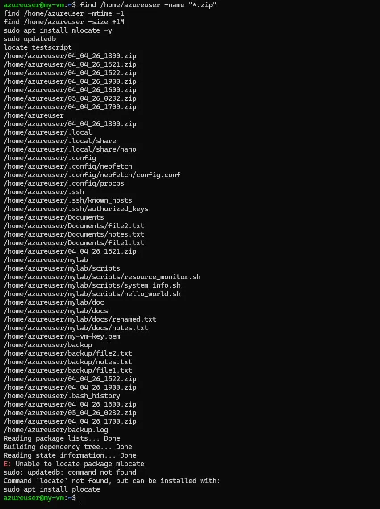

# BRG-27 — Infrastructure Systems Engineering Activity (ISEA)

**Student:** Teo Qing Ya Audrey  
**Kaplan ID:** CT0384570  
**Murdoch ID:** 36060198  
**Module:** BRG-27 Introduction to Server Environments and Architectures  
**Host OS:** Windows 11 Pro  
**Linux Environment:** Ubuntu 24.04.4 LTS via WSL 2

---

## About This Repository

This repository documents my hands-on lab work for the BRG-27 Infrastructure Systems Engineering Activity module at Murdoch University. Each folder corresponds to a lab session covering a core area of Linux administration, cloud infrastructure, and server management.

The labs progress from foundational Linux skills, setting up the environment, navigating the file system, managing services and permissions, through to real-world infrastructure topics such as cloud provisioning on Microsoft Azure, DNS configuration, SSL certificates, and shell scripting automation.

All Linux lab work was performed on Ubuntu 24.04.4 LTS running natively on Windows 11 via WSL 2. Cloud labs were performed on Microsoft Azure using a Standard B2ats v2 virtual machine. Each lab folder contains a written walkthrough of the steps taken, commands used, observations made, and reflections on what was learned. Screenshots are included as evidence of hands-on completion.

This repository also serves as preparation for the final video demonstration, where all lab work and key technical concepts will be presented and explained.

---

## Environment

| Component | Details |
|-----------|---------|
| Host OS | Windows 11 Pro |
| Linux Method | Windows Subsystem for Linux (WSL 2) |
| Distribution | Ubuntu 24.04.4 LTS (Noble Numbat) |
| Kernel | 6.6.87.2-microsoft-standard-WSL2 |
| Architecture | x86_64 |

---
# Lab 1b — Familiarity with Ubuntu Linux

**Module:** BRG-27 ISEA  
**Day:** 1b  
**Status:** Completed

---

## Objective

Get hands-on with core Linux administration from basic command line navigation through to managing services, users, firewalls, SSH, and file compression. The loopback address `127.0.0.1` was used to simulate a partner machine, which is common industry practice for testing network configurations locally before going live.

---

## Environment

| Component | Details |
|-----------|---------|
| OS | Ubuntu 24.04.4 LTS via WSL 2 |
| Shell | bash |
| Primary User | XiaoXuee |
| Simulated Partner | audrey_test (via 127.0.0.1) |

---

## Learning Objectives

- Navigate the Linux file system using basic CLI commands
- Install and configure Apache, SSH server, and firewall (UFW)
- Test web service accessibility over LAN
- Use nmap to detect open services and ports
- Use SSH and SCP for remote access and file transfer
- Create and manage users and understand privilege separation
- Compress and decompress files using tar and bzip2
- Apply file permissions using chmod and transfer ownership using chown
- Configure Access Control Lists using setfacl and getfacl
- Search the file system using find with name, time, and size filters

---

## Part 1 — Basic Command Line Navigation

Practiced moving around the Linux file system using `pwd`, `ls`, and `cd`. `pwd` confirmed the home directory at `/home/user`. `ls /etc` revealed the full collection of system configuration files. `cd ~` returned to home from any location.

---

## Part 2 — Creating Files and Directories

Used `mkdir` and `touch` to create a working directory and files inside it. `ls -l` confirmed both files were created with `-rw-r--r--` permissions.

---

## Part 3 — Linux Directory Structure

Explored the three key system directories:

| Directory | Purpose |
|-----------|---------|
| `/etc` | System-wide configuration files — network, accounts, service configs |
| `/var` | Variable runtime data — logs, mail, spool, crash reports |
| `/home` | User home directories — personal files and settings per user |

---

## Part 4 — Manual Pages

Used `man ls` to explore the built-in documentation for the `ls` command. The man page lists all available flags and options without requiring internet access.

---

## Part 5 — CLI File Operations & System Info

Practiced creating, copying, and viewing files. Checked system information using `uname -a`, `hostnamectl`, and `ps -e`. The process list confirmed that services such as `sshd`, `apache2`, and `systemd` were running.

---

## Part 6 — Super User & Permissions

Demonstrated privilege escalation with `whoami` and `sudo whoami`. Attempted `adduser` without sudo, it failed. With sudo, it succeeded.

---

## Part 7 — Install Apache and Test Web Access

Installed Apache using `sudo apt install apache2` and visited `http://127.0.0.1` in the browser to confirm the default page was live. Used `ip a` to determine the machine's IP address.

---

## Part 8 — Edit index.html and Share with Partner

Edited `/var/www/html/index.html` using nano to replace the default Apache page with a custom page, "Peer Page, Modified by Audrey Teo". Verified the content with `cat`, then visited `http://127.0.0.1` in the browser to confirm the change was live.

---

## Part 9 — Scan Ports with Nmap and Remove Apache

Ran `nmap 127.0.0.1` to scan open ports — both port 22 (SSH) and port 80 (HTTP) showed as open with Apache running. Removed Apache and reran Nmap, port 80 disappeared, confirming that removing a service directly closes its port.

---

## Part 10 — Enable UFW and Observe Service Access

Enabled UFW and allowed port 80. Observed that blocking port 80 via UFW prevented web access, even with Apache running, showing that the firewall and the service are independent security layers.

---

## Part 11 — Attempt SSH and Troubleshoot with UFW Rules

Attempted SSH into the partner machine using the loopback address. Troubleshot connectivity issues by checking UFW rules and ensuring OpenSSH was allowed through the firewall.

---

## Part 12 — Create a New User and SSH

Created a new user `audrey_test` using `sudo adduser` and SSH'd into the machine using that account to simulate connecting to a partner machine.

---

## Part 13 — Download Books Using wget

Downloaded books from Project Gutenberg using `wget` to practice retrieving files from the internet via the command line.

---

## Part 14 — Create Directory, Move Files, Create tar Archive

Created a `books/` directory, moved downloaded files into it, and created a tar archive.

---

## Part 15 — Compress, Decompress, and Extract

Compressed the tar archive using `bzip2`, then decompressed and extracted it to verify the contents were intact.

---

## Part 16 — User Management and Privilege Escalation (Azure VM)

A new user named `labuser` was created on the Azure VM using `sudo adduser labuser`. The account was then added to the `sudo` group using `sudo usermod -aG sudo labuser`. The `groups labuser` command confirmed that `labuser` was a member of the `labuser`, `sudo`, and `users` groups, verifying that administrative access was granted explicitly and intentionally rather than by default. This reinforces the principle of least privilege — users should only receive the minimum permissions required for their role.

---

## Part 17 — File Ownership with chown

A test file named `acltest.txt` was created in the azureuser home directory. Its ownership was then transferred to `labuser` using `sudo chown labuser /home/azureuser/acltest.txt`. The `ls -la` command confirmed that the file owner was updated from `azureuser` to `labuser`, while the group remained unchanged. Transferring file ownership is used in production environments when files need to be managed by a different user account, such as when a service is deployed under a dedicated non-root user.

---

## Part 18 — File Permission Levels with chmod

Two distinct permission states were applied to `acltest.txt` to demonstrate the practical effect of the Unix permission model. First, `chmod 700` restricted access entirely to the file owner, producing `rwx------`. This is the appropriate permission level for private scripts or sensitive configuration files. Second, `chmod 644` was applied, producing `rw-r--r--`, granting the owner read and write access while allowing all other users read-only access. This is the standard permission level for web-served content and shared reference files. Both states were confirmed using `ls -la`.

---

## Part 19 — Access Control Lists with setfacl and getfacl

Access Control Lists (ACLs) extend the standard Unix permission model by allowing fine-grained access rules for specific named users or groups, independent of the file owner and group. The `acl` package was installed using `sudo apt install acl -y`. An ACL entry was then applied to `acltest.txt` using `sudo setfacl -m u:azureuser:rw /home/azureuser/acltest.txt`, granting explicit read-write access to the `azureuser` account at the ACL level. The `getfacl` command confirmed the entry was applied correctly, displaying `user::rw-`, `user:azureuser:rw-`, `group::rw-`, `mask::rw-`, and `other::r--`.

ACLs are particularly useful when multiple users or processes require different levels of access to a shared file without changing its primary owner or group — a common requirement in multi-user server environments.

---

## Part 20 — File System Search with find

The `find` command was used to search the Azure VM file system by multiple criteria. Running `find /home/azureuser -name "*.zip"` returned all ZIP archives created by the automated backup script, providing a clear audit trail of backup activity. The `-mtime -1` flag filtered for files modified within the last 24 hours, and `-size +1M` identified files larger than one megabyte. The `locate` command was also tested using the `plocate` package (the Ubuntu 24.04 replacement for `mlocate`), returning the full path of the `testscript` binary in `/usr/bin/`.

These search techniques are essential for routine system maintenance — identifying old backups consuming disk space, locating recently modified files after an incident, and auditing large files before storage runs out.

---

## Challenge Activities

### Challenge 1 — Remote File Creation via SSH

SSH'd into `audrey_test` and created `remote_task.txt` remotely, confirming that SSH provides a full shell on the remote machine.

### Challenge 2 — Remote GUI Apps via SSH

Attempted to launch `gedit` over SSH, but it failed because `gedit` requires a display server. SSH provides terminal access only.

### Challenge 3 & 4 — SCP File Transfer

Used SCP to transfer a single file and recursively copy the entire `books/` directory to the partner machine.

---

## Issues Encountered

| Issue | Resolution |
|-------|------------|
| `bzip2` not installed | Ran `sudo apt install bzip2 -y` |
| `gedit` failed over SSH | Expected GUI apps require `ssh -X` for display forwarding |
| `mlocate` package unavailable on Ubuntu 24.04 | Used `plocate` instead, which is the current replacement package |

---

## Outcome

- Navigated the Linux file system using `pwd`, `ls`, `cd`, `mkdir`, and `touch`
- Installed and tested the Apache web server, edited `index.html` using nano
- Scanned open ports using Nmap before and after removing Apache, confirming port 80 disappeared when the service was removed
- Configured UFW firewall rules and observed independent control over service accessibility
- Created a new user and SSH'd between accounts using the loopback address
- Downloaded files with `wget`, compressed with `tar` and `bzip2`, transferred with `scp`
- Demonstrated privilege escalation with `sudo` and discussed the principle of least privilege
- Created a new user `labuser` and added them to the `sudo` group using `usermod`
- Transferred file ownership using `chown` and verified the change with `ls -la`
- Applied and compared file permission levels using `chmod 700` and `chmod 644`
- Configured an Access Control List using `setfacl` and verified it using `getfacl`
- Searched the file system using `find` with name, modification time, and size filters

---

## Day 1 Reflection

Day 1 was about learning to navigate and control a Linux system from first principles. Starting with the command line felt unfamiliar at first — there is no GUI to fall back on, and every action requires knowing the exact command and its syntax. Working through `pwd`, `ls`, `cd`, `mkdir`, and `touch` made it clear that the terminal is not just an alternative to a GUI but a more precise and scriptable way to interact with a system. Understanding the directory structure — why `/etc` holds configuration, `/var` holds runtime data, and `/home` holds user files — made the system feel less like a black box and more like something with a logical design.

Installing Apache and testing it over the loopback address brought together several concepts at once. The web server had to be installed, the firewall had to allow port 80, and the browser had to be pointed at the right IP — if any one of those steps was wrong, nothing worked. That dependency chain was an early lesson in how services, network rules, and DNS must be aligned for a user to reach a page. Running Nmap before and after removing Apache showed that a service and a firewall rule are two separate controls: removing the service closed the port even without touching the firewall, which reinforced that the firewall is not the only line of defense.

Managing users and applying permissions made the security model concrete. Using `sudo` only when necessary, creating `audrey_test` as a separate account, and SSHing into it locally demonstrated why privilege separation matters — running everything as root means a single mistake can compromise the entire system. The permissions work extended this further: `chmod 700` restricted a file to the owner only, `chmod 644` allowed others to read it but not modify it, and ACLs allowed a specific named user to be granted access without changing the file's owner or group. This layered approach — where standard permissions set the baseline and ACLs provide exceptions — is how real multi-user environments manage shared resources without opening everything up. Setting a file to `777` may seem convenient for testing, but it removes all control at once and creates habits that lead to incidents in production.

Searching the file system with `find` tied the day together by showing how to audit what is actually on a system. Finding backup archives by name, filtering by modification time, and identifying large files by size are all tasks that come up in real administration work — whether that is cleaning up disk space, investigating a change after an incident, or locating a script that was placed somewhere unexpected. The difference between `-mtime` and `-atime` was a useful distinction: a file that has been read but not changed would be invisible to a modify-time search, which matters when tracing unauthorized access to sensitive configuration files or private keys.

---

# Lab 2a — Total Cost of Ownership (TCO) Analysis

**Module:** BRG-27 ISEA  
**Day:** 2a  
**Status:** Completed

---

## Objective

Apply TCO methodology to a real-world procurement decision by comparing two printer models over a five-year period. The exercise required gathering manufacturer specifications, defining usage assumptions, calculating fixed and variable costs using a spreadsheet, and interpreting the results to make a justified recommendation.

---

## Environment

| Component | Details |
|-----------|---------|
| Tool | Microsoft Excel |
| Comparison Period | 5 Years |
| Printer A | Canon PIXMA G3020 (Ink Tank, Wireless, Print/Scan/Copy) |
| Printer B | HP LaserJet Pro M404n (Mono Laser, Network, Print Only) |
| Currency | SGD |

---

## Learning Objectives

- Define TCO and distinguish between fixed and variable costs
- Use spreadsheet formulas to calculate and compare total costs across printer types
- Define and document assumptions clearly and consistently
- Evaluate procurement decisions based on calculated TCO data
- Compare cost models for different usage scenarios

---

## Assumptions & Methodology

All costs were calculated using the assumptions below. Pricing was sourced from manufacturer spec sheets, Officeworks, and SP Group electricity rates.

---

## TCO Spreadsheet — 5-Year Cost Comparison

The spreadsheet below documents every cost line item for both printers, using formulas to derive totals from the assumptions above.

---

## How Costs Were Calculated

The table below summarises the calculation method for each cost component side by side.

### Summary of Results

| Printer | 5-Year TCO |
|---------|-----------|
| Canon PIXMA G3020 | SGD $3,578.30 |
| HP LaserJet Pro M404n | SGD $9,217.00 |
| **Canon saves** | **SGD $5,638.70** |

The Canon PIXMA G3020 is significantly cheaper over five years. Its ink tank system costs a fraction of laser toner, and its 11W active power draw, compared with 380W for the HP, means electricity costs are negligible. Even with contingency replacement units budgeted for both printers, Canon remains the more cost-effective choice. The HP M404n offers faster speeds (38 ppm vs 9 ipm) and suits mono-only, high-speed office environments where print speed and network reliability outweigh running costs.

---

## Day 2a Reflection

The TCO exercise reframed how I think about cost. The instinct when comparing two products is to look at the purchase price, but the purchase price is often the smallest part of what something actually costs over time. The Canon printer costs less upfront than the HP, but the more significant difference came from consumables and electricity — the HP's laser toner and 380W power draw accumulated costs that dwarfed the initial price gap over five years. Building the spreadsheet forced every assumption to be made explicit and documented, making the conclusion traceable rather than just a feeling.

The same logic applies directly to cloud infrastructure. Choosing a cloud provider based on the cheapest compute instance ignores data egress fees, snapshot storage, support tiers, and the cost of downtime if the provider has weaker SLAs. A proper TCO comparison for a cloud environment would model all of those costs across a realistic usage pattern — including peak loads, idle periods, and growth projections — before committing to a platform. The printer exercise was small in scope, but the methodology it taught is the same one used in enterprise procurement decisions worth orders of magnitude more.

---

## Outcome

- Defined and applied TCO methodology to a real procurement scenario
- Documented all assumptions with sources and calculation basis
- Built a structured spreadsheet comparing fixed and variable costs across two printer models
- Calculated a 5-year TCO showing Canon at SGD $3,578.30 versus HP at SGD $9,217.00
- Identified break-even conditions and non-financial factors affecting the decision
- Produced a justified recommendation based on quantitative analysis

---

# Lab 2b — Cloud Computing & Bash Scripting

**Module:** BRG-27 ISEA  
**Day:** 2b  
**Status:** Completed

---

## Objective

Launch and configure a cloud virtual machine on Microsoft Azure, install and serve content using Apache2, and demonstrate file management, network access, and remote connectivity. The lab was then extended with Bash scripting, writing and executing shell scripts for system information, loops, conditionals, and automated resource monitoring.

---

## Environment

| Component | Details |
|-----------|---------|
| Cloud Platform | Microsoft Azure |
| VM Name | my-vm |
| OS | Ubuntu 24.04.4 LTS |
| VM Size | Standard B2ats v2 (2 vCPUs, 1 GiB RAM) |
| Region | Central India (Zone 1) |
| Public IP | 98.70.33.154 |
| Local OS | Windows 11 |
| SSH Client | Windows Command Prompt (native SSH) |
| Username | azureuser |

---

## Learning Objectives

- Launch and configure a cloud VM on Microsoft Azure
- Configure Network Security Group rules to allow SSH and HTTP traffic
- Connect to a remote VM using SSH with a private key
- Install and verify the Apache2 web server
- Edit live web content using the nano text editor
- Transfer files remotely using wget, sudo cp, and scp
- Set file permissions using chmod
- Test network latency using ping
- Write and execute Bash scripts incorporating conditionals, loops, and system monitoring

---

## Part 1 — SSH into the Azure VM

The Azure VM was accessed from Windows Command Prompt using a private key downloaded from the Azure portal. The original key had not been saved when the VM was created, so it was reset via the Azure portal's Reset Password interface, which generated a new key pair and allowed the private key to be downloaded. The SSH command was then run, specifying the key file path and the VM's public IP address. The terminal prompt changed to `azureuser@my-vm`, confirming a successful remote connection.

---

## Part 2 — Update Package List

Before installing any software, the package index was updated to ensure all subsequent installations would pull the latest available versions from the Ubuntu repositories.

---

## Part 3 — Install Apache2

Apache2 was installed using the package manager. All dependencies were automatically resolved and installed, and the web server service was started immediately upon installation completion.

---

## Part 4 — Configure Network Security Group

By default, only port 22 (SSH) was permitted in the Azure Network Security Group attached to the VM. A new inbound rule was created to allow HTTP traffic on port 80, which is required for the web server to be publicly accessible from a browser.

| Rule | Port | Protocol | Action |
|------|------|----------|--------|
| SSH | 22 | TCP | Allow |
| HTTP | 80 | TCP | Allow |

---

## Part 5 — Verify Apache in Browser

The VM's public IP address was entered into a browser to confirm Apache2 was running and serving content. The default Ubuntu Apache2 welcome page loaded successfully, confirming the web server was live, and the port 80 rule was working correctly.

---

## Part 6 — Edit index.html Using Nano

The default Apache web page was opened in the nano text editor directly on the server. A custom heading was added to the HTML body to verify that edits to files in the web directory take effect immediately without requiring an Apache restart.

---

## Part 7 — Replace index.html with Custom Page and Add Hyperlinks

The entire default Apache page was replaced with a clean custom HTML page. The new page included a heading, a descriptive paragraph, and a list of anchor tags linking to external resources demonstrating the use of HTML hyperlinks served from a live cloud web server. The file was written directly to disk using a heredoc approach to avoid paste limitations encountered in the terminal session.

---

## Part 8 — Download and Copy Files Using wget and sudo cp

A remote image file was downloaded to the VM using wget, then copied into the Apache web directory using sudo cp. This demonstrated how files can be retrieved from the internet directly on the server and placed in a publicly served directory without any involvement from the local machine.

---

## Part 9 — Test Access from Mobile Device

The web server was accessed from a mobile phone browser using the same public IP address to confirm that the server was reachable across different devices and network types, verifying its public accessibility.

---

## Part 10 — Network Latency Testing with ping

The ping command was used to measure network latency from the VM to servers in three different geographic regions. All responses returned under 4ms, which reflects that Google's globally distributed infrastructure automatically routes requests to the nearest available node regardless of the domain suffix used.

| Target | Average Latency |
|--------|----------------|
| google.com | 3.497 ms |
| google.co.jp | 3.072 ms |
| google.co.za | 3.170 ms |

---

## Part 11 — File Transfer Using SCP

A file was securely transferred from the local Windows machine to the Azure VM using SCP with the private key for authentication. This demonstrated an alternative method for uploading files to a remote server: pushing directly from the local machine rather than pulling from a remote URL.

---

## Part 12 — Set File Permissions Using chmod

Restrictive permissions were applied to the private key file using chmod 600, ensuring only the file owner can read or write it. The result was confirmed using ls -la, which returned `-rw-------`, the standard required permission level for SSH private keys. If a key file has broader permissions, SSH will refuse to use it as a security measure.

---

## Part 13 — Bash Lab: Navigate File System and Manage Files

### Directory Creation and Navigation

A working directory structure was created for the Bash scripting exercises. A main lab directory was created, then two subdirectories, one for scripts and one for documentation, were created inside it. The ls command was used to confirm the structure was in place.

### File Operations

Core file management commands were practiced by creating a new file, copying it under a different name, and renaming the copy using the move command. Listing the directory contents afterward confirmed all three operations completed successfully.

---

## Part 14 — Bash Script: hello_world.sh

A basic shell script was written and saved using nano. It opened with the shebang line to specify the Bash interpreter, then used echo to print a greeting, and command substitution to dynamically display the hostname and current date and time at runtime. The script was made executable by changing its permissions, then run directly from the terminal. The output confirmed all three lines printed correctly with live system values.

---

## Part 15 — Bash Script: system_info.sh

A more structured script was written, incorporating a for loop to produce a countdown from 3 to 1, the read command to accept user input, and an if/elif/else conditional block to evaluate the input and return an appropriate response. When run with the name "Audrey", the script completed the countdown and returned a personalized greeting confirming that the loop and conditional logic both functioned as expected.

---

## Part 16 — Bash Script: resource_monitor.sh

A resource-monitoring script was written that first asks the user how many monitoring cycles to run, then loops through each cycle, displaying memory usage, disk usage, and CPU load at each iteration, with a 2-second pause between checks. Running the script with two iterations showed memory at 419Mi used of 846Mi total, disk at 8% used, and CPU idle above 88%, confirming the server was running well within its resource limits.

---

## Day 2b Reflection

Provisioning a cloud VM felt very different from running something locally. The machine exists somewhere else, is accessible from anywhere, and starts accruing costs the moment it runs, which immediately makes the decisions around security groups and auto-shutdown feel real rather than academic. Opening port 22 was the first necessary step because SSH is the only way in; without it, the VM is unreachable. Opening port 80 happened after Apache was installed, not before, because there is no reason to expose a port until something is listening on it. That order of operations — install the service, then open the port — is the right discipline to build, and it is easy to do it backward and forget to close ports later.

The SSH key issue was an early lesson in how unforgiving security controls can be. The private key was not saved when the VM was first created, so accessing the machine required returning to the Azure portal and resetting the credentials entirely. Once the key was downloaded and in use, the `chmod 600` step was not optional — SSH refuses to connect if the private key is readable by other users, because a world-readable private key is effectively no security at all. That enforcement by the SSH client is a good example of a system that makes the secure path the only path.

Working through the Bash scripting exercises connected the command-line skills from Day 1 to something more practical. The shebang line at the top of a script tells the operating system which interpreter to run — without it, the script may not execute correctly depending on the shell environment. The for loop, if/elif/else conditional, and resource monitoring script each demonstrated a different layer of what automation can do: repeat a task, make a decision based on input, and check the state of a running system. The resource monitor reading from `/proc/net/dev` to calculate bandwidth was a good illustration of how Linux exposes system internals through the file system; instead of needing a special tool, you can read the raw data directly and calculate what you need.

Leaving a VM running continuously is a risk on two fronts: it keeps charging even when no work is happening, and it keeps the attack surface exposed around the clock. Configuring auto-shutdown to power the VM down each evening addressed both — it bounded the cost and reduced the window during which the machine could be targeted. The distinction between DNS and `/etc/hosts` came up naturally when setting up the server: DNS propagates globally and is the right tool for a public service, while `/etc/hosts` is a local override useful in development but invisible to anyone outside the machine.

---

## Issues Encountered

| Issue | Resolution |
|-------|------------|
| SSH private key not saved at VM creation | Reset via Azure portal, generated and downloaded a new key pair |
| PowerShell did not recognize the SSH command | Switched to Windows Command Prompt, which has native SSH support built in |
| Paste disabled in CMD after SSH connection | Switched to Windows Terminal, which supports Ctrl+Shift+V paste consistently |
| Commands merged into one line when pasting | Ran commands individually and used heredoc syntax for multi-line file creation |

---

## Outcome

- Launched and configured an Ubuntu 24.04 VM on Microsoft Azure
- Reset and downloaded an SSH private key via the Azure portal
- Added an HTTP inbound rule to the Network Security Group to allow port 80
- Installed Apache2 and served a live custom HTML page with working hyperlinks
- Transferred files using wget, sudo cp, and scp
- Applied correct file permissions using chmod and verified the result with ls -la
- Tested network latency with ping across multiple regional targets
- Created and executed three Bash scripts covering echo, for loops, if/elif/else conditionals, interactive input, and system resource monitoring
- Verified public server access from both desktop and mobile browsers

---

# Lab 3a — DNS Configuration & HTTPS with Let's Encrypt

**Module:** BRG-27 ISEA  
**Day:** 3a  
**Status:** Completed

---

## Objective

Configure a publicly accessible domain name using DuckDNS, verify DNS propagation using command-line tools, and secure the Apache web server with a free TLS certificate issued by Let's Encrypt via Certbot. The end result is a fully functioning HTTPS-enabled web server accessible via a domain name.

---

## Environment

| Component | Details |
|-----------|---------|
| Cloud Platform | Microsoft Azure |
| VM Public IP | 98.70.33.154 |
| Domain Name | xiaoxuee.duckdns.org |
| DNS Provider | DuckDNS (free dynamic DNS) |
| Web Server | Apache2 on Ubuntu 24.04.4 LTS |
| Certificate Authority | Let's Encrypt (via Certbot) |

---

## Learning Objectives

- Register a free domain name and configure an A record pointing to a cloud server
- Verify DNS resolution using nslookup and dig from a Linux terminal
- Install and run Certbot to obtain and deploy a TLS certificate automatically
- Open port 443 in the Azure Network Security Group to allow HTTPS traffic
- Verify a secure HTTPS connection in a browser and understand certificate metadata

---

## Part 1 — Register Domain and Configure A Record

A free subdomain was registered at DuckDNS using a GitHub account. The domain `xiaoxuee.duckdns.org` was created and the A record was updated to point to the Azure VM's public IP address, `98.70.33.154`. DuckDNS confirmed the update immediately with a success message, and the change timestamp was recorded in the dashboard.

---

## Part 2 — Verify DNS Propagation

DNS resolution was tested from inside the Azure VM using both `nslookup` and `dig`. Both tools confirmed that `xiaoxuee.duckdns.org` resolved correctly to `98.70.33.154`. The dig output also showed a TTL of 46 seconds, status NOERROR, and a query time of 0 milliseconds — indicating that the record was already cached by the local resolver.

---

## Part 3 — Access Server via Domain Name in Browser

The domain name was entered into a browser to confirm that HTTP traffic was being routed correctly through DNS to the Apache web server. The custom page loaded successfully and displayed the expected content. The browser displayed "Not secure" at this stage because HTTPS had not yet been configured.

---

## Part 4 — Install Certbot

Certbot and the Apache plugin were installed from the Ubuntu package repository. All dependencies were automatically resolved and installed, including the ACME client libraries required for Let's Encrypt certificate issuance.

---

## Part 5 — First Certbot Attempt (Failed — Learning Point)

On the first run of Certbot, only the subdomain portion `xiaoxuee` was entered instead of the fully qualified domain name. Let's Encrypt rejected the request because a valid domain name must contain at least one dot. This is a real-world validation rule enforced by the ACME protocol — certificate authorities will not issue certificates for bare hostnames or single-label names.

---

## Part 6 — Successful Certificate Issuance

Certbot was run again with the full domain name `xiaoxuee.duckdns.org`. The certificate was successfully issued by Let's Encrypt and automatically deployed to Apache. The certificate was saved to `/etc/letsencrypt/live/xiaoxuee.duckdns.org/` and is valid until 3 July 2026. Certbot also configured automatic renewal via a scheduled background task.

---

## Part 7 — Open Port 443 in Azure Network Security Group

Before HTTPS could be accessed in a browser, port 443 needed to be opened in the Azure Network Security Group. A new inbound rule was created allowing TCP traffic on port 443 from any source, following the same process used earlier to open port 80 for HTTP.

| Rule | Port | Protocol | Action |
|------|------|----------|--------|
| SSH | 22 | TCP | Allow |
| HTTP | 80 | TCP | Allow |
| HTTPS | 443 | TCP | Allow |

---

## Part 8 — Verify HTTPS in Browser

The site was accessed via `https://xiaoxuee.duckdns.org` in a browser. The padlock icon appeared in the address bar, confirming that the TLS certificate was active and trusted, and that the connection was encrypted. The custom web page loaded correctly over HTTPS without any certificate warnings.

---

## Day 3a Reflection

Day 3a was the day when all the infrastructure layers built across the previous sessions had to work together simultaneously, and that dependency made every step feel more consequential. DNS had to be configured correctly before anything else could happen — without the A record pointing to the VM's public IP, there was no domain to issue a certificate for. Verifying propagation using `nslookup` and `dig`, rather than just a browser, was important because browsers cache DNS locally, so they might show a correct result even when the global DNS system has not yet updated. The 46-second TTL that dig reported explained why DuckDNS propagated so quickly: resolvers around the world were forced to refresh their cached entries within less than a minute.

The Certbot process made the interdependency of the entire stack explicit. The first run failed because only the subdomain label was entered rather than the fully qualified domain name — a straightforward input error, but one that revealed how precisely the ACME protocol validates domain names. Port 80 had to remain open even after the goal was HTTPS, because the HTTP-01 challenge Certbot uses to verify domain ownership requires Let's Encrypt's servers to retrieve a token from port 80. Only after that verification succeeded could the certificate be issued and port 443 become meaningful. Opening port 443 in the Azure NSG was then the final step — without it, the certificate existed on the server but was unreachable from the outside. The padlock appearing in the browser at the end of the day was not just a visual confirmation that HTTPS worked; it represented the complete chain from a registered domain, through DNS resolution, through a verified TLS certificate, through an open firewall rule, to an encrypted connection — every link in that chain had to be correctly configured, and a failure at any point would have broken the whole thing.

---

## Issues Encountered

| Issue | Resolution |
|-------|------------|
| First Certbot attempt rejected | Entered the full domain `xiaoxuee.duckdns.org` instead of just the subdomain |
| HTTPS not accessible after certificate issued | Port 443 was not yet open in the Azure NSG — added inbound rule for TCP 443 |

---

## Outcome

- Registered a free domain `xiaoxuee.duckdns.org` via DuckDNS and configured the A record to point to the Azure VM
- Verified DNS resolution using nslookup and dig from the VM terminal
- Confirmed HTTP access via domain name in a browser
- Installed Certbot and the Apache plugin from the Ubuntu repository
- Successfully obtained and deployed a TLS certificate from Let's Encrypt
- Opened port 443 in the Azure Network Security Group
- Verified HTTPS access with a valid padlock in the browser

---

# Lab 3b — Bash Backup Scripting, Cron Jobs & Login Customization

**Module:** BRG-27 ISEA  
**Day:** 3b  
**Status:** Completed

---

## Objective

Write a Bash script to automate file backups with date-stamped filenames, make it available system-wide, schedule it with cron for hourly and boot-time execution, and log all output to a file. The lab was then extended by customizing the server login experience using figlet and neofetch.

---

## Environment

| Component | Details |
|-----------|---------|
| Cloud Platform | Microsoft Azure |
| VM | my-vm — Ubuntu 24.04.4 LTS |
| Shell | Bash |
| User | azureuser |

---

## Learning Objectives

- Write a Bash script using variables, date formatting, and file operations
- Use cp, zip, and echo to automate backup and logging tasks
- Grant execute permissions and move scripts to /usr/bin for system-wide access
- Schedule automated tasks using cron, including hourly and boot-time execution
- Customize the login experience using figlet and neofetch

---

## Part 1 — Create Test Files and Directory Structure

A Documents directory and a backup directory were created under the azureuser home folder to simulate a working environment. Three test files were created inside Documents to serve as the content to be backed up. The ls command confirmed all three files were in place before the script was written.

---

## Part 2 — Write and Run the Backup Script

A Bash script named `testscript` was written using a heredoc command to avoid paste limitations in the terminal. The script uses the `date` command to generate a timestamp in `DD_MM_YY_HHMM` format, recursively copies the Documents directory into the backup folder, creates a dated ZIP archive of the backup contents, copies the zip file to the home directory for easy access, and appends a log entry to `backup.log` with the completion timestamp.

The script was made executable using chmod 777, then run manually to verify all steps completed without error. The zip output confirmed all three files were archived, and the log entry appeared immediately with the correct timestamp and filename.

---

## Part 3 — Move Script to /usr/bin and Test System-Wide Execution

The script was moved to `/usr/bin/testscript` using sudo mv, making it accessible from any directory on the system without specifying a path. It was then run again simply by typing `testscript` from the home directory. The backup log showed a second entry with a new timestamp, confirming the script executed correctly as a system-wide command.

---

## Part 4 — Schedule Cron Job for Hourly Execution

The root crontab was opened using `sudo crontab -e`. A new cron entry was added at the bottom of the file using the standard five-field cron syntax, scheduling the script to run at the start of every hour. The crontab was saved and the system confirmed the new crontab was installed successfully.

---

## Challenge 1 — Boot-Time Script Execution

The root crontab was updated to include an `@reboot` entry alongside the existing hourly job. This ensures the backup script runs automatically whenever the server starts, without manual intervention. The final crontab listing confirmed both entries were active.

---

## Challenge 2 — Login Message Customization with figlet and neofetch

`figlet` and `neofetch` were installed from the Ubuntu package repository to customize the server login experience. figlet renders large ASCII art banners from plain text, while neofetch displays a system summary including OS version, CPU, memory, and uptime, alongside the Ubuntu logo.

Both tools were run after installation to verify the output. figlet rendered a Welcome banner, and neofetch displayed the full system summary for the Azure VM, confirming both tools were working correctly.

---

## Day 3b Reflection

Day 3b brought together the scripting skills from Day 2b and applied them to a real operational problem: reliable, automated backup. Writing the script was straightforward once the logic was clear: generate a timestamp, copy the source directory, zip it, log the result — but getting it to run correctly under cron required understanding why the same script behaves differently in an automated context. Cron executes in a minimal shell environment with a restricted PATH, meaning a command like `zip` that works perfectly in an interactive terminal may not be found at all when cron runs the script. Using absolute paths throughout, both in the script and in the crontab entry itself, was not an optional tidiness measure — it was what made the difference between a script that works reliably and one that fails silently at 2 am with no indication of what went wrong.

The `@reboot` crontab entry extended this thinking further: a backup that runs only hourly provides no protection during the window between a server starting and the first scheduled run. Adding a boot-time execution entry ensured the server would always have a current backup, regardless of when it last ran. The SCP cloud export step could not be completed because only one VM was provisioned, and without a second server, there is no remote destination. This was a genuine limitation rather than a configuration error, and it highlighted an important aspect of backup strategy: a backup stored on the same machine as the data it protects offers no resilience against the failure of that machine. The figlet and neofetch work at the end of the day was lighter, but it reinforced the same principle that appeared throughout the module in environments with multiple servers; every detail that helps an administrator immediately orient themselves when they connect reduces the risk of making a change on the wrong machine.

---

## Issues Encountered

| Issue | Resolution |
|-------|------------|
| zip command not found on first script run | Installed zip using apt before re-running the script |
| Log file permission denied when writing to /var/log | Changed log file path to /home/azureuser/backup.log, which the user has write access to |
| SCP cloud export step not completable | Only one VM was provisioned — documented as a known limitation in the reflection |

---

## Outcome

- Created a test directory structure with sample files to simulate a working backup target
- Wrote a Bash script that generates a date-stamped ZIP archive and logs each run with a timestamp
- Made the script executable and moved it to /usr/bin for system-wide availability
- Scheduled the script to run hourly and at boot using root crontab entries
- Installed figlet and neofetch and verified login message customization

---

# Lab 4 — Additional Server Services: MariaDB

**Module:** BRG-27 ISEA  
**Day:** 4  
**Status:** Completed

---

## Objective

Deploy MariaDB as an additional server service on the existing Ubuntu VM, verify the installation, and demonstrate practical database operations, including creating a database and table, inserting records, and performing UPDATE and DELETE queries.

---

## Environment

| Component | Details |
|-----------|---------|
| Cloud Platform | Microsoft Azure |
| VM | my-vm — Ubuntu 24.04.4 LTS |
| Database | MariaDB 10.11.14 |
| User | azureuser |

---

## Learning Objectives

- Install and enable MariaDB on an Ubuntu server
- Connect to the MariaDB shell as root and verify the installation
- Create a database and define a table with appropriate data types and constraints
- Insert, query, update, and delete records using SQL

---

## Part 1 — Install and Verify MariaDB

MariaDB was installed from the Ubuntu package repository. The package manager automatically resolved and installed all required dependencies. After installation, the MariaDB service was started and confirmed to be running.

A root login was performed using `sudo mysql -u root` to confirm the database service was accessible and operational.

The `SHOW DATABASES` command was run to confirm the default system databases were present, including the newly created `labdb`.

The initial verification using the MariaDB shell confirmed a clean installation with all default system databases in place.

---

## Part 2 — Create Database and Table, Insert Records

A test database named `labdb` was created and selected. A `students` table was defined with three columns — `id` as an integer primary key, `name` as a varchar column, and `grade` as a two-character column. Two records were inserted and retrieved using a SELECT query to confirm that the data was stored correctly.

The table structure was inspected using the `DESCRIBE` command, confirming the column definitions, data types, and primary key constraint were applied as intended.

---

## Part 3 — Update and Delete Records

An `UPDATE` statement was used to change Bob's grade from B to A+. A `DELETE` statement then removed Alice's record. A final `SELECT` confirmed that only Bob's updated record remained in the table, verifying that both operations executed correctly.

---

## Day 4 Reflection

Deploying MariaDB independently was a different kind of challenge from the earlier labs. The installation itself was straightforward, but the work that followed, creating a database, defining a table schema, inserting records, and then modifying and deleting them, required thinking about data integrity rather than just commands. The primary key on the `students` table is what made the UPDATE and DELETE statements safe to run: without it, there is no reliable way to target a specific row, and a missing WHERE clause would affect every record in the table. That is not a theoretical risk — it is one of the most common causes of accidental data loss in production databases.

The CRUD exercise also made it clear that installing a service is only the beginning. A default MariaDB installation includes anonymous user accounts and a test database that require no authentication, which means the database is effectively open to any local process or user until `mysql_secure_installation` is run. The labs were conducted in a controlled environment where the VM's NSG blocked external access to port 3306, providing a layer of network protection, but in a production deployment, that layer cannot be the only one. Securing the database at the application level — removing anonymous accounts, setting a strong root password, and restricting remote root login is not optional.

The choice of MariaDB over MySQL is worth reflecting on. MariaDB maintains full compatibility with MySQL's SQL syntax and client libraries, meaning any application built for MySQL connects to MariaDB without modification. The practical implication is that MariaDB can be substituted into existing infrastructure without rewriting application code — a significant advantage when migrating or consolidating database services. Understanding why two tools are interchangeable, rather than just knowing they are, matters when making deployment decisions in environments where compatibility is required.

Across all four days, the consistent thread was that no component works in isolation. SSH access depends on the correct permissions for the SSH key. Apache serving content depends on the correct NSG rule. Certbot issuing a certificate depends on DNS resolving and port 80 being open. Cron running a backup depends on absolute paths in the script. MariaDB's data protection depends on post-installation hardening. Each layer builds on the one before it, and a gap at any level undermines everything above it.

---

## Issues Encountered

| Issue | Resolution |
|-------|------------|
| None | Installation and all SQL operations completed without error |

---

## Outcome

- Installed MariaDB and confirmed the service was running on the Ubuntu VM
- Connected to the MariaDB shell as root and verified the default databases
- Created a database and a structured table with a primary key constraint
- Inserted, queried, updated, and deleted records to demonstrate full CRUD functionality

---
