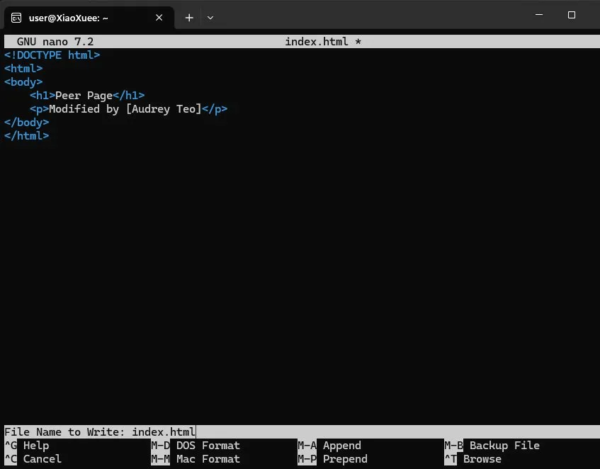
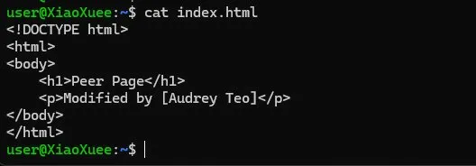
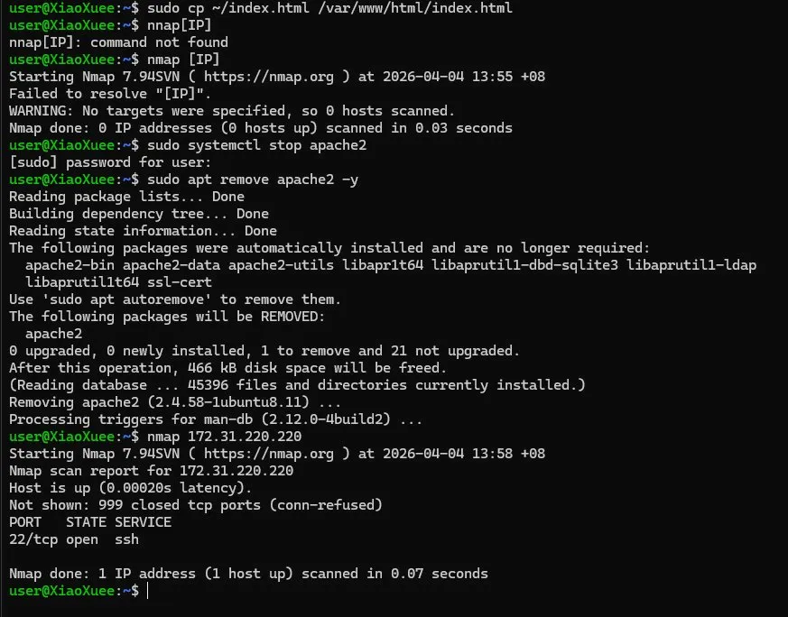
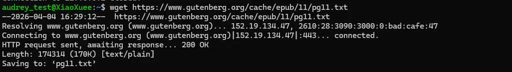
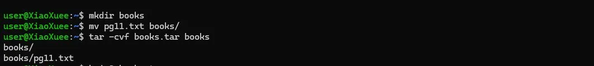
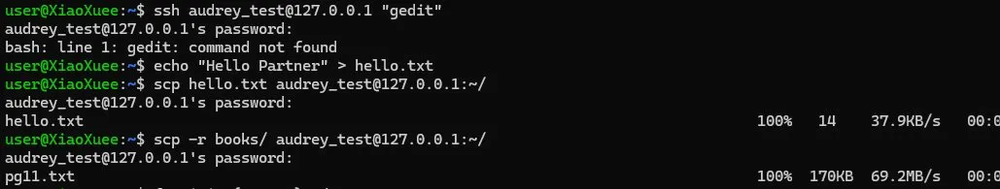

# BRG-27 — Infrastructure Systems Engineering Activity (ISEA)

**Student:** Teo Qing Ya Audrey  
**Kaplan ID:** CT0384570  
**Murdoch ID:** 36060198  
**Module:** BRG-27 Introduction to Server Environments and Architectures  
**Host OS:** Windows 11 Pro  
**Linux Environment:** Ubuntu 24.04.4 LTS via WSL 2

---

## About This Repository

This repository documents my hands-on lab work for the BRG-27 Infrastructure Systems Engineering Activity module at Murdoch University. Each folder corresponds to a lab session covering a core area of Linux administration, cloud infrastructure, and server management.

The labs progress from foundational Linux skills, setting up the environment, navigating the file system, managing services and permissions, through to real-world infrastructure topics such as cloud provisioning on AWS, DNS configuration, SSL certificates, and shell scripting automation.

All Linux lab work was performed on Ubuntu 24.04.4 LTS running natively on Windows 11 via WSL 2. Cloud labs were performed on Amazon Web Services (AWS) using the free tier. Each lab folder contains a written walkthrough of the steps taken, commands used, observations made, and reflections on what was learned. Screenshots are included as evidence of hands-on completion.

This repository also serves as preparation for the final video demonstration, where all lab work and key technical concepts will be presented and explained.

---

## Environment

| Component | Details |
|-----------|---------|
| Host OS | Windows 11 Pro |
| Linux Method | Windows Subsystem for Linux (WSL 2) |
| Distribution | Ubuntu 24.04.4 LTS (Noble Numbat) |
| Kernel | 6.6.87.2-microsoft-standard-WSL2 |
| Architecture | x86_64 |

---
# Lab 1b — Familiarity with Ubuntu Linux

**Module:** BRG-27 ISEA  
**Day:** 1b  
**Status:** Completed

---

## Objective

Get hands-on with core Linux administration from basic command line navigation through to managing services, users, firewalls, SSH, and file compression. The loopback address `127.0.0.1` was used to simulate a partner machine, which is common industry practice for testing network configurations locally before going live.

---

## Environment

| Component | Details |
|-----------|---------|
| OS | Ubuntu 24.04.4 LTS via WSL 2 |
| Shell | bash |
| Primary User | XiaoXuee |
| Simulated Partner | audrey_test (via 127.0.0.1) |

---

## Learning Objectives

- Navigate the Linux file system using basic CLI commands
- Install and configure Apache, SSH server, and firewall (UFW)
- Test web service accessibility over LAN
- Use nmap to detect open services and ports
- Use SSH and SCP for remote access and file transfer
- Create and manage users and understand privilege separation
- Compress and decompress files using tar and bzip2

---

## Part 1 — Basic Command Line Navigation

Practiced moving around the Linux file system using `pwd`, `ls`, and `cd`. `pwd` confirmed the home directory at `/home/user`. `ls /etc` revealed the full collection of system configuration files. `cd ~` returned to home from any location.


---

## Part 2 — Creating Files and Directories

Used `mkdir` and `touch` to create a working directory and files inside it. `ls -l` confirmed both files were created with `-rw-r--r--` permissions.


---

## Part 3 — Linux Directory Structure

Explored the three key system directories:

| Directory | Purpose |
|-----------|---------|
| `/etc` | System-wide configuration files — network, accounts, service configs |
| `/var` | Variable runtime data — logs, mail, spool, crash reports |
| `/home` | User home directories — personal files and settings per user |


---

## Part 4 — Manual Pages

Used `man ls` to explore the built-in documentation for the `ls` command. The man page lists all available flags and options without requiring internet access.


---

## Part 5 — CLI File Operations & System Info

Practiced creating, copying, and viewing files. Checked system information using `uname -a`, `hostnamectl`, and `ps -e`. The process list confirmed that services such as `sshd`, `apache2`, and `systemd` were running.


---

## Part 6 — Super User & Permissions

Demonstrated privilege escalation with `whoami` and `sudo whoami`. Attempted `adduser` without sudo, it failed. With sudo, it succeeded.


---

## Part 7 — Install Apache and Test Web Access

Installed Apache using `sudo apt install apache2` and visited `http://127.0.0.1` in the browser to confirm the default page was live. Used `ip a` to determine the machine's IP address.


---

## Part 8 — Edit index.html and Share with Partner

Edited `/var/www/html/index.html` using nano to replace the default Apache page with a custom page, "Peer Page, Modified by Audrey Teo". Verified the content with `cat`, then visited `http://127.0.0.1` in the browser to confirm the change was live.






---

## Part 9 — Scan Ports with Nmap and Remove Apache

Ran `nmap 127.0.0.1` to scan open ports — both port 22 (SSH) and port 80 (HTTP) showed as open with Apache running. Removed Apache and reran Nmap, port 80 disappeared, confirming that removing a service directly closes its port.




---

## Part 10 — Enable UFW and Observe Service Access

Enabled UFW and allowed port 80. Observed that blocking port 80 via UFW prevented web access, even with Apache running, showing that the firewall and the service are independent security layers.

```bash
sudo ufw enable
sudo ufw allow 80
sudo ufw status
```


---

## Part 11 — Attempt SSH and Troubleshoot with UFW Rules

Attempted SSH into the partner machine using the loopback address. Troubleshot connectivity issues by checking UFW rules and ensuring OpenSSH was allowed through the firewall.

```bash
sudo ufw allow OpenSSH
ssh audrey_test@127.0.0.1
```


---

## Part 12 — Create a New User and SSH

Created a new user `audrey_test` using `sudo adduser` and SSH'd into the machine using that account to simulate connecting to a partner machine.


---

## Part 13 — Download Books Using wget

Downloaded books from Project Gutenberg using `wget` to practice retrieving files from the internet via the command line.

```bash
wget https://www.gutenberg.org/cache/epub/11/pg11.txt
```



---

## Part 14 — Create Directory, Move Files, Create tar Archive

Created a `books/` directory, moved downloaded files into it, and created a tar archive.

```bash
mkdir books
mv pg11.txt books/
tar -cvf books.tar books
```



---

## Part 15 — Compress, Decompress, and Extract

Compressed the tar archive using `bzip2`, then decompressed and extracted it to verify the contents were intact.

```bash
bzip2 books.tar
ls -lh books.tar.bz2
bunzip2 books.tar.bz2
tar -xvf books.tar
```


---

## Challenge Activities

### Challenge 1 — Remote File Creation via SSH

SSH'd into `audrey_test` and created `remote_task.txt` remotely, confirming that SSH provides a full shell on the remote machine.


### Challenge 2 — Remote GUI Apps via SSH

Attempted to launch `gedit` over SSH, but it failed because `gedit` requires a display server. SSH provides terminal access only.

### Challenge 3 & 4 — SCP File Transfer

Used SCP to transfer a single file and recursively copy the entire `books/` directory to the partner machine.

```bash
scp hello.txt audrey_test@127.0.0.1:~/
scp -r books/ audrey_test@127.0.0.1:~/
```




---

## Issues Encountered

| Issue | Resolution |
|-------|------------|
| `bzip2` not installed | Ran `sudo apt install bzip2 -y` |
| `gedit` failed over SSH | Expected GUI apps require `ssh -X` for display forwarding |

---

## Outcome

- Navigated the Linux file system using `pwd`, `ls`, `cd`, `mkdir`, and `touch.`
- Installed and tested the Apache web server, edited `index.html` using nano
- Scanned open ports using Nmap before and after removing Apache, and confirmed that port 80 disappeared
- Configured UFW firewall rules and observed independent control over service accessibility
- Created a new user and SSH'd between accounts using the loopback address
- Downloaded files with `wget`, compressed with `tar` and `bzip2`, transferred with `scp.`
- Demonstrated privilege escalation with `sudo` and discussed the principle of least privilege

---

## Reflection

Using `127.0.0.1` as a loopback to simulate a partner was a practical way to test SSH and SCP without needing a second machine. The Nmap exercise clearly showed that removing a service closes its port; a running service and a firewall rule are two independent controls. The gedit failure over SSH was a good reminder that servers are headless by default and all administration must be done through the terminal.

---

# Lab 2a — Total Cost of Ownership (TCO) Analysis

**Module:** BRG-27 ISEA  
**Day:** 2a  
**Status:** Completed

---

## Objective

Apply TCO methodology to a real-world procurement decision by comparing two printer models over a five-year period. The exercise required gathering manufacturer specifications, defining usage assumptions, calculating fixed and variable costs using a spreadsheet, and interpreting the results to make a justified recommendation.

---

## Environment

| Component | Details |
|-----------|---------|
| Tool | Microsoft Excel |
| Comparison Period | 5 Years |
| Printer A | Canon PIXMA G3020 (Ink Tank, Wireless, Print/Scan/Copy) |
| Printer B | HP LaserJet Pro M404n (Mono Laser, Network, Print Only) |
| Currency | SGD |

---

## Learning Objectives

- Define TCO and distinguish between fixed and variable costs
- Use spreadsheet formulas to calculate and compare total costs across printer types
- Define and document assumptions clearly and consistently
- Evaluate procurement decisions based on calculated TCO data
- Compare cost models for different usage scenarios

---

## Assumptions & Methodology

All costs were calculated using the assumptions below. Pricing was sourced from manufacturer spec sheets, Officeworks, and SP Group electricity rates.


---

## TCO Spreadsheet — 5-Year Cost Comparison

The spreadsheet below documents every cost line item for both printers, using formulas to derive totals from the assumptions above.


---

## How Costs Were Calculated

The table below summarises the calculation method for each cost component side by side.


### Summary of Results

| Printer | 5-Year TCO |
|---------|-----------|
| Canon PIXMA G3020 | SGD $3,578.30 |
| HP LaserJet Pro M404n | SGD $9,217.00 |
| **Canon saves** | **SGD $5,638.70** |

The Canon PIXMA G3020 is significantly cheaper over five years. Its ink tank system costs a fraction of laser toner, and its 11W active power draw versus 380W for the HP means electricity costs are negligible. Even with contingency replacement units budgeted for both printers, Canon remains the more cost-effective choice. The HP M404n offers faster speeds (38 ppm vs 9 ipm) and suits mono-only, high-speed office environments where print speed and network reliability outweigh running costs.

---

## Reflection Questions


---

## Outcome

- Defined and applied TCO methodology to a real procurement scenario
- Documented all assumptions with sources and calculation basis
- Built a structured spreadsheet comparing fixed and variable costs across two printer models
- Calculated a 5-year TCO showing Canon at SGD $3,578.30 versus HP at SGD $9,217.00
- Identified break-even conditions and non-financial factors affecting the decision
- Produced a justified recommendation based on quantitative analysis

---

# Lab 2b — Cloud Computing & Bash Scripting

**Module:** BRG-27 ISEA  
**Day:** 2b  
**Status:** Completed

---

## Objective

Launch and configure a cloud virtual machine on Microsoft Azure, install and serve content using Apache2, and demonstrate file management, network access, and remote connectivity. The lab was then extended with Bash scripting, writing and executing shell scripts for system information, loops, conditionals, and automated resource monitoring.

---

## Environment

| Component | Details |
|-----------|---------|
| Cloud Platform | Microsoft Azure |
| VM Name | my-vm |
| OS | Ubuntu 24.04.4 LTS |
| VM Size | Standard B2ats v2 (2 vCPUs, 1 GiB RAM) |
| Region | Central India (Zone 1) |
| Public IP | 98.70.33.154 |
| Local OS | Windows 11 |
| SSH Client | Windows Command Prompt (native SSH) |
| Username | azureuser |

---

## Learning Objectives

- Launch and configure a cloud VM on Microsoft Azure
- Configure Network Security Group rules to allow SSH and HTTP traffic
- Connect to a remote VM using SSH with a private key
- Install and verify the Apache2 web server
- Edit live web content using the nano text editor
- Transfer files remotely using wget, sudo cp, and scp
- Set file permissions using chmod
- Test network latency using ping
- Write and execute Bash scripts incorporating conditionals, loops, and system monitoring

---

## Part 1 — SSH into the Azure VM

The Azure VM was accessed from Windows Command Prompt using a private key downloaded from the Azure portal. The original key had not been saved when the VM was created, so it was reset via the Azure portal's Reset Password interface, which generated a new key pair and allowed the private key to be downloaded. The SSH command was then run, specifying the key file path and the VM's public IP address. The terminal prompt changed to `azureuser@my-vm`, confirming a successful remote connection.


---

## Part 2 — Update Package List

Before installing any software, the package index was updated to ensure all subsequent installations would pull the latest available versions from the Ubuntu repositories.


---

## Part 3 — Install Apache2

Apache2 was installed using the package manager. All dependencies were automatically resolved and installed, and the web server service was started immediately upon installation completion.


---

## Part 4 — Configure Network Security Group

By default, only port 22 (SSH) was permitted in the Azure Network Security Group attached to the VM. A new inbound rule was created to allow HTTP traffic on port 80, which is required for the web server to be publicly accessible from a browser.

| Rule | Port | Protocol | Action |
|------|------|----------|--------|
| SSH | 22 | TCP | Allow |
| HTTP | 80 | TCP | Allow |


---

## Part 5 — Verify Apache in Browser

The VM's public IP address was entered into a browser to confirm Apache2 was running and serving content. The default Ubuntu Apache2 welcome page loaded successfully, confirming the web server was live, and the port 80 rule was working correctly.


---

## Part 6 — Edit index.html Using Nano

The default Apache web page was opened in the nano text editor directly on the server. A custom heading was added to the HTML body to verify that edits to files in the web directory take effect immediately without requiring an Apache restart.


---

## Part 7 — Replace index.html with Custom Page and Add Hyperlinks

The entire default Apache page was replaced with a clean custom HTML page. The new page included a heading, a descriptive paragraph, and a list of anchor tags linking to external resources demonstrating the use of HTML hyperlinks served from a live cloud web server. The file was written directly to disk using a heredoc approach to avoid paste limitations encountered in the terminal session.


---

## Part 8 — Download and Copy Files Using wget and sudo cp

A remote image file was downloaded to the VM using wget, then copied into the Apache web directory using sudo cp. This demonstrated how files can be retrieved from the internet directly on the server and placed in a publicly served directory without any involvement from the local machine.


---

## Part 9 — Test Access from Mobile Device

The web server was accessed from a mobile phone browser using the same public IP address to confirm that the server was reachable across different devices and network types, verifying its public accessibility.


---

## Part 10 — Network Latency Testing with ping

The ping command was used to measure network latency from the VM to servers in three different geographic regions. All responses returned under 4ms, which reflects that Google's globally distributed infrastructure automatically routes requests to the nearest available node regardless of the domain suffix used.

| Target | Average Latency |
|--------|----------------|
| google.com | 3.497 ms |
| google.co.jp | 3.072 ms |
| google.co.za | 3.170 ms |


---

## Part 11 — File Transfer Using SCP

A file was securely transferred from the local Windows machine to the Azure VM using SCP with the private key for authentication. This demonstrated an alternative method for uploading files to a remote server: pushing directly from the local machine rather than pulling from a remote URL.


---

## Part 12 — Set File Permissions Using chmod

Restrictive permissions were applied to the private key file using chmod 600, ensuring only the file owner can read or write it. The result was confirmed using ls -la, which returned `-rw-------`, the standard required permission level for SSH private keys. If a key file has broader permissions, SSH will refuse to use it as a security measure.


---

## Part 13 — Bash Lab: Navigate File System and Manage Files

### Directory Creation and Navigation

A working directory structure was created for the Bash scripting exercises. A main lab directory was created, then two subdirectories, one for scripts and one for documentation, were created inside it. The ls command was used to confirm the structure was in place.


### File Operations

Core file management commands were practiced by creating a new file, copying it under a different name, and renaming the copy using the move command. Listing the directory contents afterward confirmed all three operations completed successfully.


---

## Part 14 — Bash Script: hello_world.sh

A basic shell script was written and saved using nano. It opened with the shebang line to specify the Bash interpreter, then used echo to print a greeting, and command substitution to dynamically display the hostname and current date and time at runtime. The script was made executable by changing its permissions, then run directly from the terminal. The output confirmed all three lines printed correctly with live system values.


---

## Part 15 — Bash Script: system_info.sh

A more structured script was written, incorporating a for loop to produce a countdown from 3 to 1, the read command to accept user input, and an if/elif/else conditional block to evaluate the input and return an appropriate response. When run with the name "Audrey", the script completed the countdown and returned a personalized greeting confirming that the loop and conditional logic both functioned as expected.


---

## Part 16 — Bash Script: resource_monitor.sh

A resource-monitoring script was written that first asks the user how many monitoring cycles to run, then loops through each cycle, displaying memory usage, disk usage, and CPU load at each iteration, with a 2-second pause between checks. Running the script with two iterations showed memory at 419Mi used of 846Mi total, disk at 8% used, and CPU idle above 88%, confirming the server was running well within its resource limits.


---

## Reflection Questions

**What were the benefits of cloud deployment over local virtualization?**

Cloud deployment removes the need for dedicated local hardware. The VM was provisioned within minutes, accessible from any device with a network connection, and could be stopped when idle to avoid unnecessary charges. Local virtualization requires a capable host machine and is not remotely accessible without additional configuration.

**How does Apache serve files, and how did you verify this?**

Apache listens on port 80 for incoming HTTP requests and serves files from the `/var/www/html/` directory. Verification was done by accessing the VM's public IP in a browser and confirming that the correct page loaded, both the default page and the modified custom page, reflecting changes made directly to the files on the server.

**What did you learn about file ownership and permissions?**

The chmod command controls who can read, write, or execute a file. Setting a file to 600 restricts access to the owner only. This is the required permission for SSH private keys; if the key file is readable by other users, SSH will reject it as a security risk.

**What risks are associated with leaving instances running?**

A running VM continues to accumulate compute charges even when no work is being performed on it. It also remains exposed to the internet, which increases the attack surface. Azure's auto-shutdown feature was configured to power down the VM at 7:00 PM UTC daily to address both concerns.

**How would you explain the difference between DNS and /etc/hosts to a client?**

DNS is a globally distributed system that resolves domain names to IP addresses across the Internet. The /etc/hosts file is a local override; its entries take precedence over DNS on that machine only. It is commonly used in development or testing environments to point a domain name to a local or staging server without modifying public DNS records.

**What is the purpose of the shebang line in a Bash script?**

The shebang line at the top of a script tells the operating system which interpreter to use when the script is executed directly. Without it, the system may not know which shell to invoke, and the script may not run as intended.

**What does the free command show?**

It displays current memory usage in a human-readable format, including total RAM, amount in use, amount free, shared memory, buffer, and cache usage, and the amount available for new processes. On this VM, it showed 846 Mi total RAM, with 419 Mi in use.

**How would you monitor network bandwidth in a Bash script?**

By reading from the /proc/net/dev file, which contains cumulative bytes transmitted and received per network interface. Sampling this file at regular intervals and calculating the difference between readings gives a real-time bandwidth figure without requiring additional tools to be installed.

---

## Issues Encountered

| Issue | Resolution |
|-------|------------|
| SSH private key not saved at VM creation | Reset via Azure portal, generated and downloaded a new key pair |
| PowerShell did not recognize the SSH command | Switched to Windows Command Prompt, which has native SSH support built in |
| Paste disabled in CMD after SSH connection | Switched to Windows Terminal, which supports Ctrl+Shift+V paste consistently |
| Commands merged into one line when pasting | Ran commands individually and used heredoc syntax for multi-line file creation |

---

## Outcome

- Launched and configured an Ubuntu 24.04 VM on Microsoft Azure
- Reset and downloaded an SSH private key via the Azure portal
- Added an HTTP inbound rule to the Network Security Group to allow port 80
- Installed Apache2 and served a live custom HTML page with working hyperlinks
- Transferred files using wget, sudo cp, and scp
- Applied correct file permissions using chmod and verified the result with ls -la
- Tested network latency with ping across multiple regional targets
- Created and executed three Bash scripts covering echo, for loops, if/elif/else conditionals, interactive input, and system resource monitoring
- Verified public server access from both desktop and mobile browsers

---

# Lab 3a — DNS Configuration & HTTPS with Let's Encrypt

**Module:** BRG-27 ISEA  
**Day:** 3a  
**Status:** Completed

---

## Objective

Configure a publicly accessible domain name using DuckDNS, verify DNS propagation using command-line tools, and secure the Apache web server with a free TLS certificate issued by Let's Encrypt via Certbot. The end result is a fully functioning HTTPS-enabled web server accessible via a domain name.

---

## Environment

| Component | Details |
|-----------|---------|
| Cloud Platform | Microsoft Azure |
| VM Public IP | 98.70.33.154 |
| Domain Name | xiaoxuee.duckdns.org |
| DNS Provider | DuckDNS (free dynamic DNS) |
| Web Server | Apache2 on Ubuntu 24.04.4 LTS |
| Certificate Authority | Let's Encrypt (via Certbot) |

---

## Learning Objectives

- Register a free domain name and configure an A record pointing to a cloud server
- Verify DNS resolution using nslookup and dig from a Linux terminal
- Install and run Certbot to obtain and deploy a TLS certificate automatically
- Open port 443 in the Azure Network Security Group to allow HTTPS traffic
- Verify a secured HTTPS connection in a browser and understand certificate metadata

---

## Part 1 — Register Domain and Configure A Record

A free subdomain was registered at DuckDNS using a GitHub account. The domain `xiaoxuee.duckdns.org` was created and the A record was updated to point to the Azure VM's public IP address, `98.70.33.154`. DuckDNS confirmed the update immediately with a success message, and the change timestamp was recorded in the dashboard.


---

## Part 2 — Verify DNS Propagation

DNS resolution was tested from inside the Azure VM using both `nslookup` and `dig`. Both tools confirmed that `xiaoxuee.duckdns.org` resolved correctly to `98.70.33.154`. The dig output additionally showed a TTL of 46 seconds, status NOERROR, and query time of 0 milliseconds — indicating the record was already cached by the local resolver.


---

## Part 3 — Access Server via Domain Name in Browser

The domain name was entered into a browser to confirm that HTTP traffic was being routed correctly through DNS to the Apache web server. The custom page loaded successfully, displaying the expected content. The browser showed "Not secure" at this stage, as HTTPS had not yet been configured.


---

## Part 4 — Install Certbot

Certbot and the Apache plugin were installed from the Ubuntu package repository. All dependencies were resolved and installed automatically, including the ACME client libraries required for Let's Encrypt certificate issuance.


---

## Part 5 — First Certbot Attempt (Failed — Learning Point)

On the first run of Certbot, only the subdomain portion `xiaoxuee` was entered instead of the fully qualified domain name. Let's Encrypt rejected the request because a valid domain name must contain at least one dot. This is a real-world validation rule enforced by the ACME protocol — certificate authorities will not issue certificates for bare hostnames or single-label names.


---

## Part 6 — Successful Certificate Issuance

Certbot was run again with the full domain name `xiaoxuee.duckdns.org`. The certificate was successfully issued by Let's Encrypt and automatically deployed to the Apache configuration. The certificate was saved to `/etc/letsencrypt/live/xiaoxuee.duckdns.org/` and is valid until 3 July 2026. Certbot also configured automatic renewal via a scheduled background task.


---

## Part 7 — Open Port 443 in Azure Network Security Group

Before HTTPS could be accessed in a browser, port 443 needed to be opened in the Azure Network Security Group. A new inbound rule was created allowing TCP traffic on port 443 from any source, following the same process used earlier to open port 80 for HTTP.

| Rule | Port | Protocol | Action |
|------|------|----------|--------|
| SSH | 22 | TCP | Allow |
| HTTP | 80 | TCP | Allow |
| HTTPS | 443 | TCP | Allow |


---

## Part 8 — Verify HTTPS in Browser

The site was accessed via `https://xiaoxuee.duckdns.org` in a browser. The padlock icon appeared in the address bar, confirming the TLS certificate was active, trusted, and the connection was encrypted. The custom web page loaded correctly over HTTPS without any certificate warnings.


---

## Reflection Questions

**Why is HTTPS important for modern web applications?**

HTTPS encrypts all data transmitted between the client and server, protecting it from interception, tampering, and eavesdropping. Without it, login credentials, form submissions, and session tokens are transmitted in plain text and can be captured by anyone on the same network. Modern browsers also mark HTTP sites as "Not secure", which reduces user trust and affects search engine ranking.

**What entity issued your site's TLS certificate?**

The certificate was issued by Let's Encrypt, a free, automated, and open certificate authority operated by the Internet Security Research Group (ISRG). It is trusted by all major browsers and operating systems.

**How long is your certificate valid for, and how can it be renewed?**

The certificate is valid for 90 days, expiring on 3 July 2026. Certbot automatically configures a scheduled renewal task that runs twice daily and renews the certificate when it is within 30 days of expiry. No manual intervention is required under normal circumstances.

**What happens if a certificate expires and is not renewed?**

Browsers will display a full-page warning blocking access to the site, stating that the connection is not private or that the certificate has expired. Most users will not proceed past this warning, effectively taking the site offline from a practical standpoint. APIs and automated clients may also refuse connections with expired certificates.

**Why does Let's Encrypt require port 80 or 443 to be open for verification?**

Let's Encrypt uses the ACME protocol to verify that the requester controls the domain they are requesting a certificate for. The HTTP-01 challenge method requires port 80 to be accessible so that Let's Encrypt's servers can retrieve a verification token placed on the web server. Without this, the certificate authority has no way to confirm domain ownership and will refuse to issue a certificate.

**Why does DNS propagation take time?**

DNS records are cached by resolvers around the world according to each record's TTL value. When a record is updated, existing cached copies remain valid until they expire. The propagation delay is the time it takes for all caches globally to expire their old entries and fetch the updated record. DuckDNS uses a short TTL, which is why propagation was nearly instant in this lab.

---

## Issues Encountered

| Issue | Resolution |
|-------|------------|
| First Certbot attempt rejected | Entered the full domain `xiaoxuee.duckdns.org` instead of just the subdomain |
| HTTPS not accessible after certificate issued | Port 443 was not yet open in the Azure NSG — added inbound rule for TCP 443 |

---

## Outcome

- Registered a free domain `xiaoxuee.duckdns.org` via DuckDNS and configured the A record to point to the Azure VM
- Verified DNS resolution using nslookup and dig from the VM terminal
- Confirmed HTTP access via domain name in a browser
- Installed Certbot and the Apache plugin from the Ubuntu repository
- Successfully obtained and deployed a TLS certificate from Let's Encrypt
- Opened port 443 in the Azure Network Security Group
- Verified HTTPS access with a valid padlock in the browser

---

# Lab 3b — Bash Backup Scripting, Cron Jobs & Additional Server Services

**Module:** BRG-27 ISEA  
**Day:** 3b  
**Status:** Completed

---

## Objective

Write a Bash script to automate file backups with date-stamped filenames, make the script available system-wide, schedule it using cron for hourly execution, and log all output to a file. The lab was then extended by installing and verifying MariaDB as an example of deploying additional server services on the same Ubuntu VM.

---

## Environment

| Component | Details |
|-----------|---------|
| Cloud Platform | Microsoft Azure |
| VM | my-vm — Ubuntu 24.04.4 LTS |
| Shell | Bash |
| Database | MariaDB 10.11.14 |
| User | azureuser |

---

## Learning Objectives

- Write a Bash script using variables, date formatting, and file operations
- Use cp, zip, and echo to automate backup and logging tasks
- Grant execute permissions and move scripts to /usr/bin for system-wide access
- Schedule automated tasks using cron
- Install and verify a database server (MariaDB)

---

## Part 1 — Create Test Files and Directory Structure

A Documents directory and a backup directory were created under the azureuser home folder to simulate a working environment. Three test files were created inside Documents to serve as the content to be backed up. The ls command confirmed all three files were in place before the script was written.


---

## Part 2 — Write and Run the Backup Script

A Bash script named `testscript` was written using a heredoc command to avoid paste limitations in the terminal. The script uses the `date` command to generate a timestamp in `DD_MM_YY_HHMM` format, recursively copies the Documents directory into the backup folder, creates a dated ZIP archive of the backup contents, copies the zip file to the home directory for easy access, and appends a log entry to `backup.log` with the completion timestamp.

The script was made executable using chmod 777, then run manually to verify all steps completed without error. The zip output confirmed all three files were archived, and the log entry appeared immediately with the correct timestamp and filename.


---

## Part 3 — Move Script to /usr/bin and Test System-Wide Execution

The script was moved to `/usr/bin/testscript` using sudo mv, making it accessible from any directory on the system without specifying a path. It was then run again simply by typing `testscript` from the home directory. The backup log showed a second entry with a new timestamp, confirming the script executed correctly as a system-wide command.


---

## Part 4 — Schedule Cron Job for Hourly Execution

The root crontab was opened using `sudo crontab -e`. A new cron entry was added at the bottom of the file using the standard five-field cron syntax, scheduling the script to run at the start of every hour. The crontab was saved and the system confirmed the new crontab was installed successfully.


---

## Part 5 — Install and Verify MariaDB

MariaDB was installed as an example of deploying an additional server service. The package manager resolved and installed all 37 required packages automatically. After installation, the MariaDB service was started and a root login was performed to verify the database was operational. The SHOW DATABASES command returned the four default system databases — `information_schema`, `mysql`, `performance_schema`, and `sys` — confirming a clean and functional installation.


---

## Reflection Questions

**Why is using absolute paths important in scripts run by cron?**

Cron jobs run in a minimal environment with a restricted PATH variable, meaning commands and file references that work interactively may not be found when cron executes the same script. Using absolute paths such as `/usr/bin/zip` and `/home/azureuser/backup/` ensures the script functions correctly regardless of the environment it runs in.

**What are the benefits of cloud exporting for backups?**

Storing backups on a remote cloud server ensures they survive local failures — if the primary server is lost, corrupted, or compromised, the backup remains intact and accessible. Cloud export also supports geographic redundancy, version history, and centralised management of backups across multiple servers.

**How does cron differ from manual execution?**

Manual execution requires a user to be logged in and actively run the command. Cron runs automatically at scheduled intervals without any user interaction, even when no one is logged into the server. This makes it suitable for routine maintenance tasks that must run reliably and consistently regardless of human availability.

**What happens if SSH keys are not accepted ahead of time?**

The SCP command used to transfer backups to a remote server requires the remote host's fingerprint to be accepted before the transfer can proceed unattended. If the fingerprint has not been accepted, the SSH handshake will pause and prompt for confirmation — causing the cron job to hang or fail silently, as there is no interactive terminal available during cron execution.

**Why was the SCP cloud export step not completed?**

The SCP transfer step requires a second cloud server to act as the backup destination. In this lab environment, only one VM was provisioned, so there was no remote target available. In a production environment, this step would be implemented by provisioning a dedicated backup server or storage instance, pre-accepting its SSH fingerprint, and embedding the SCP command with an absolute key path directly in the backup script.

**How can login messages help improve user and system engagement?**

Tools such as figlet and neofetch can display system information, hostname, resource usage, and custom banners when a user logs in via SSH. This improves situational awareness by immediately showing the system state, and can also serve as a reminder of the server's purpose or environment — particularly useful in environments with multiple servers where administrators need to confirm which machine they have connected to.

---

## Issues Encountered

| Issue | Resolution |
|-------|------------|
| zip command not found on first script run | Installed zip using apt before re-running the script |
| Log file permission denied when writing to /var/log | Changed log file path to /home/azureuser/backup.log, which the user has write access to |
| SCP cloud export step not completable | Only one VM was provisioned — documented as a known limitation in the reflection |

---

## Outcome

- Created a test directory structure with sample files to simulate a working backup target
- Wrote a Bash script that generates a date-stamped ZIP archive and logs each run with a timestamp
- Made the script executable and moved it to /usr/bin for system-wide availability
- Scheduled the script to run hourly using a root crontab entry
- Installed and verified MariaDB as an additional server service, confirming database connectivity via the MariaDB shell

---
