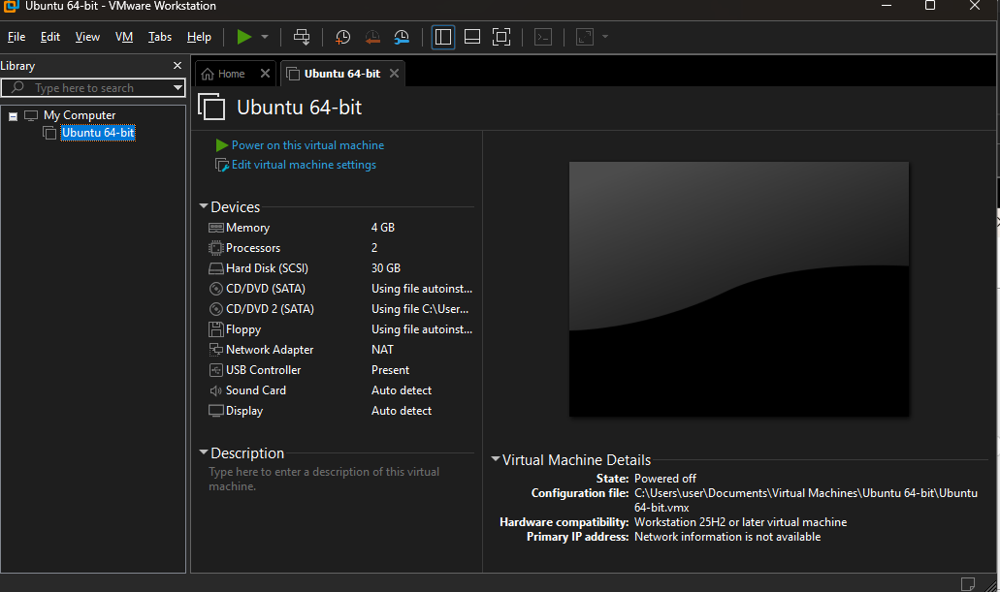
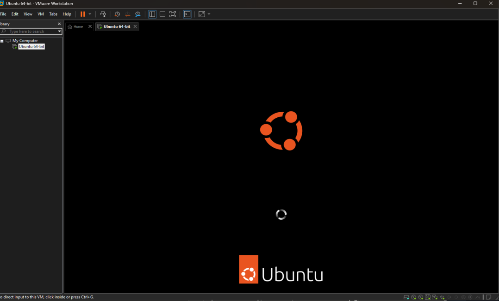
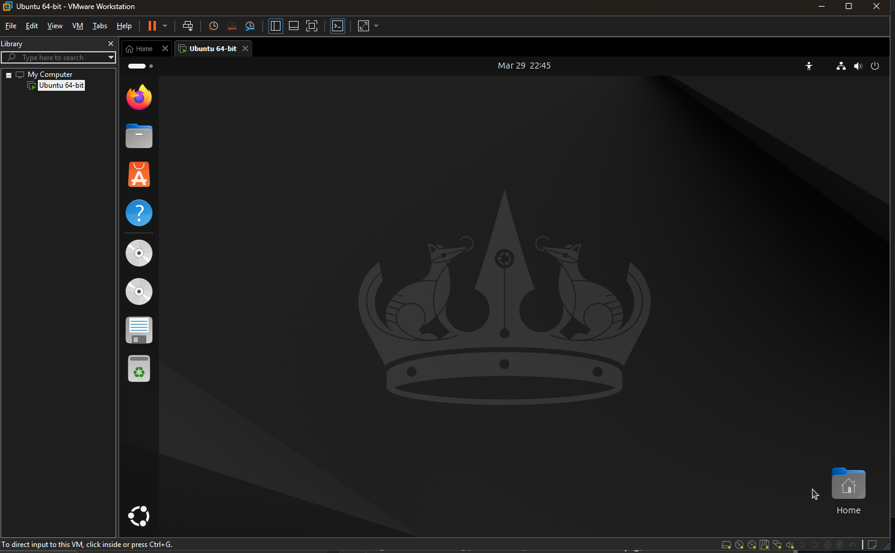

## BRG-27 Lab Activities - Introduction to Server Environments and Architectures
Student: Teo Qing Ya Audrey
<br>
Kaplan ID: CT0384570
<br>
Murdoch ID: 36060198
<br>
#

# Lab 1a — Setting Up Linux
 
**Module:** BRG-27 ISEA - **Day:** 1a
<br>
 
## Objective
 
Install Ubuntu 24.04.4 LTS as a virtual machine on a Windows 11 host using VMware Workstation Pro, and successfully boot into the Ubuntu Desktop environment.
 
---
 
## Environment
 
| Component | Details |
|-----------|---------|
| Host OS | Windows 11 Pro |
| Hypervisor | VMware Workstation Pro (25H2) |
| ISO Used | `ubuntu-24.04.4-desktop-amd64.iso` |
| Architecture | x86_64 (AMD64) |
| VM Name | Ubuntu 64-bit |
| VM vCPU | 2 cores |
| VM RAM | 4 GB |
| VM Storage | 30 GB (SCSI) |
| Network | NAT |
 
---
 
## Steps Taken
 
### 1. Download Ubuntu ISO
- Downloaded `ubuntu-24.04.4-desktop-amd64.iso` from the [official Ubuntu website](https://ubuntu.com/download/desktop)
- Verified it is the **AMD64** release — correct for Intel/AMD processors on Windows hosts
 
### 2. Create New Virtual Machine in VMware Workstation Pro
- Opened VMware Workstation Pro → **File → New Virtual Machine**
- Selected **Typical (recommended)** configuration
- Pointed installer to the downloaded Ubuntu ISO
- VMware auto-detected the OS as Ubuntu 64-bit
 
### 3. Configure VM Resources
 
| Setting | Value |
|---------|-------|
| Processors | 2 vCPUs |
| Memory | 4096 MB (4 GB) |
| Hard Disk | 30 GB (SCSI) |
| Network Adapter | NAT |
 
### 4. Install Ubuntu
- Powered on the VM — booted directly from the ISO
- Followed the Ubuntu guided installer:
  - Selected language, keyboard layout, and timezone
  - Chose **Normal installation**
  - Selected **Erase disk and install Ubuntu** (applies inside VM only)
  - Created user account and set password
- Installation completed and VM rebooted into Ubuntu Desktop
 
### 5. Post-Installation
- Logged into Ubuntu Desktop successfully
- Opened **Terminal** and confirmed system info:
 
```bash
uname -a
# Linux ubuntu 6.8.0-xx-generic #xx-Ubuntu SMP x86_64 GNU/Linux
 
lsb_release -a
# Ubuntu 24.04.4 LTS
```
 
---
 
## Outcome
 
- Ubuntu 24.04.4 LTS Desktop successfully installed and running inside VMware Workstation Pro on Windows 11 Pro
- VM is accessible, stable, and ready for subsequent labs
 
---
 
## Observations & Learnings
 
- AMD64 ISO is correct for standard Windows 11 machines running Intel or AMD processors
- VMware Workstation Pro auto-detects Ubuntu and pre-configures optimal settings (Easy Install)
- Allocating 4 GB RAM ensures the Desktop GUI runs smoothly without lag
- 30 GB disk provides enough headroom for all upcoming lab activities
 
---
 
## Issues Encountered
 
| Issue | Resolution |
|-------|------------|
| None | Installation completed without errors |

## Screenshots

**01 — VMware New VM Wizard (ISO selected & Ubuntu detected)**


**02 — VM Settings Summary**


**03 — Ubuntu Boot Screen**


**04 — Ubuntu Desktop Booted**

 
---
 
---


